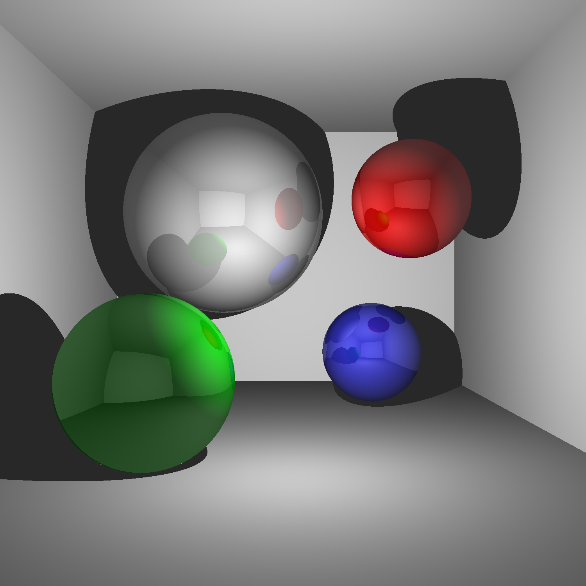

# lazor
[](https://github.com/patrickp89/lazor/actions/workflows/build.yml)

A (naive) ray tracer for WebAssembly. Most of the code was stolen from [jsoendermann/ljsp](https://github.com/jsoendermann/ljsp).

## Setup
Install Rust (e.g. via [Rustup](https://www.rust-lang.org/tools/install)),
[wasm-pack](https://rustwasm.github.io/wasm-pack/installer/), and [Node.js](https://nodejs.org/en/):
```bash
$ curl --proto '=https' --tlsv1.2 -sSf https://sh.rustup.rs | sh
$ curl https://rustwasm.github.io/wasm-pack/installer/init.sh -sSf | sh
$ curl -O https://nodejs.org/dist/v12.16.1/node-v12.16.1-linux-x64.tar.xz && tar xf node*
```

Install the Node.js packages:
```bash
$ cd www/
$ npm install
$ npm install wasm-opt -g
```

> Installing wasm-opt globally fixes a current bug!

## How to build it?
Build the WebAssembly via wasm-pack:
```bash
$ wasm-pack build
```

## Render a test scene!
Start the Node.js sever, visit [localhost:8080](http://localhost:8080/), and click the "Render!" button:
```bash
$ cd www/
$ export NODE_OPTIONS=--openssl-legacy-provider
$ npm run start
```

The rendered scene should look like this:


